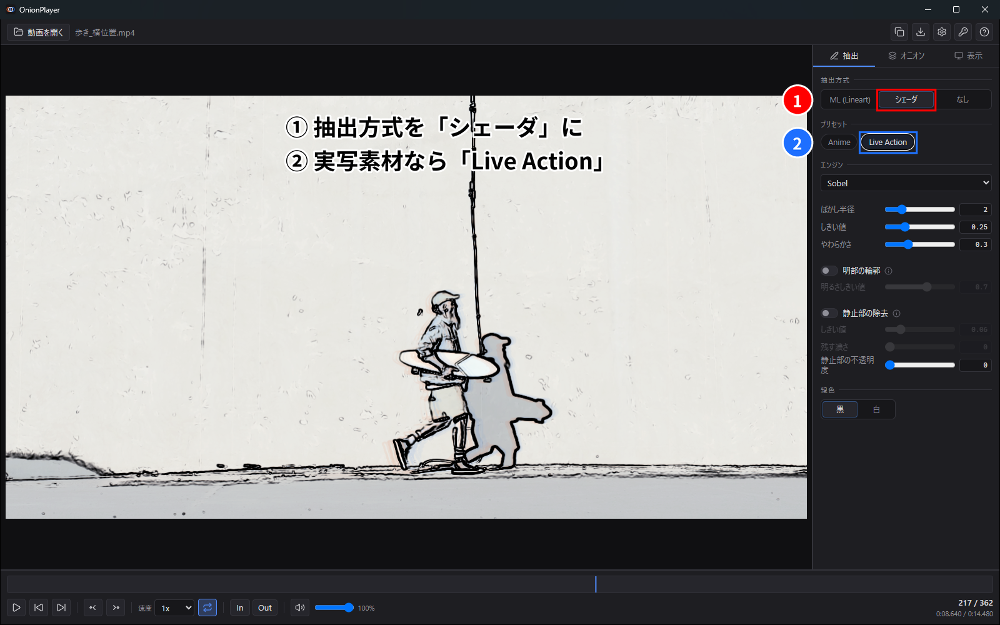

# OnionPlayer クイックスタート

**参考の動きを、線だけにして前後まとめて見る。** そのための道具です。
このページは、はじめて起動してから 5 分で「これが何をする道具か」が分かるところまでを案内します。
機能の全体は [USER_GUIDE.md](USER_GUIDE.md) にあります。

> **β版です。** v0.1.1（2026-08-26 ビルド）時点。
> 将来、一部機能（ML 抽出・書き出し）は有料になる予定です。

---

## 0. 動作環境

- Windows 10 / 11（x64）
- **Microsoft Edge WebView2 ランタイム**。Windows 11 は標準で入っています。
  入っていない環境では Microsoft の "Evergreen WebView2 Runtime" を導入してください。
- ML 抽出を使う場合は DirectML 対応の GPU があると速くなります（無い環境では自動で CPU に落ちます）。

## 1. 起動する

ZIP を展開し、**`OnionPlayer.exe` をそのまま実行**します。インストールは不要です。

- 同じフォルダにある DLL は**一緒に置いたまま**にしてください。exe だけを移すと起動しません。
- 設定・キーフレーム・あとで導入する ML モデルは、exe の隣にできる
  **`OnionPlayerData` フォルダ**に入ります。フォルダごと移動すれば全部付いてきます。

## 2. 動画を開く

**ウィンドウにドラッグ＆ドロップ**するか、**`Ctrl+O`**（ヘッダーの「動画を開く」）で選びます。

> ⚠️ **対応形式は mp4 と webm だけです。** MOV / ProRes / MKV や連番画像は開けません。
> 手元の素材が別形式なら、事前に mp4 か webm へ変換してください。

## 3. 線画にする

右パネルの **`抽出`** タブで抽出方式を選びます。

- **`シェーダ`**（図の ①） — 追加導入なしで、すぐ使えます。**まずはこれで試してください。**
  実写素材なら `プリセット` の **`Live Action`**（図の ②）、アニメ素材なら **`Anime`** から始めるとうまくいきます。
- **`ML (Lineart)`** — 品質は高いですが、**モデルの導入（約 17MB のダウンロード）が必要**で、
  かつ **Pro 機能**です（後述）。
- **`なし`** — 元の映像のまま。

## 4. オニオンスキンを入れる

**`N`** キーでオニオンスキンが入ります。前後のフレームが薄く重なって見えるようになります。

`オニオン` タブの `プリセット` から目的に合ったものを選んでください。

| プリセット | 何を見るためのものか |
|---|---|
| **中割り** | 前後 1 コマだけ。中割りの位置決め |
| **軌道** | 前後 4 コマ連続。動きの軌跡を追う |
| **スペーシング** | 3 コマおき。タメ・ツメの間隔を計測 |
| **広域** | 前後 8 コマ・2 コマおき。運動の包絡線 |

過去のフレームは暖色、未来のフレームは寒色で色分けされます。

## 5. コマを送る

移動には**2つの軸**があります。目的で使い分けてください。

| キー | 動き |
|---|---|
| **`,`** / **`.`** | **コマ送り**（厳密に 1 コマ） |
| **`←`** / **`→`** | **秒送り**（大きく移動） |
| `Space` | 再生 / 停止 |
| `J` / `L` | 速度を下げる / 上げる |

どちらも `Shift` で中くらい、`Ctrl` で大きく動きます（量は `Ctrl+P` の設定で変えられます）。

**`I`** と **`O`** で区間ループを作れます。歩行 1 サイクルだけを繰り返し見る、といった使い方ができます。

## 6. 覚えておくと詰まらないこと

**`F1` を押すと操作一覧が出ます。** 迷ったらまずこれを見てください。

そのうえで、**最初に引っかかりやすい 3 点**を先に書いておきます。

1. **開けるのは mp4 / webm だけ** です。他の形式は「動画を読み込めません」になります。
2. **ML 抽出はモデルの導入が要ります。** 抽出方式を `ML (Lineart)` にすると
   `Lineart モデル: 未導入` と出るので、**`導入 (~17MB)`** を押してください。
   導入そのものは無料で通ります。
3. **ML 抽出と書き出しは Pro 機能です。** 実行しようとすると
   「Pro ライセンスが必要です」というダイアログが出ます。**故障ではありません。**
   無料のまま使える範囲は次のとおりで、**このアプリの中心はここに入っています**:

   > シェーダ抽出 ・ **オニオンスキンの全機能** ・ 静止部の除去 ・ 方眼 ・ 区間ループ ・
   > 重ねる/並べる ・ 集中モード

   

   > **テスト期間中の注意**: このビルドは購入ページがまだ用意されていないため、
   > ダイアログに「（購入 URL は未設定です）」と表示されます。これも想定どおりの表示です。
   > 配布時にライセンスキーをお渡ししている場合は、ヘッダーの鍵アイコンから認証してください。

## 7. フィードバックで見てほしいところ

テストにご協力いただきありがとうございます。**次の 5 点について、気づいたことをそのままの言葉で
お聞かせください。** 「うまく言えないけれど違和感がある」も、そのまま書いていただけると助かります。

1. **オニオンスキンの見え方** — 層の数・間隔・濃さの既定値は、あなたの用途に合っていましたか。
   最初に触ったとき、どのプリセットを選びましたか。
2. **線画の質** — シェーダ抽出の線は、参考として使える質でしたか。
   ML 抽出まで試された場合、その差は導入の手間に見合いましたか。
3. **手が止まった場所** — 操作の途中で「どうすればいいか分からなくなった」瞬間があれば、
   **その画面と、そのとき何をしようとしていたか**を教えてください。
4. **速度** — 再生やコマ送りは、あなたの素材と PC でストレスなく動きましたか。
   引っかかった場合、素材の解像度とフレームレートも添えてください。
5. **足りないもの** — 「これがあれば実務で使う」という機能があれば教えてください。

不具合の場合は、**素材の形式・解像度・フレームレート**と、可能なら**そのときの画面**も
添えていただけると、原因にたどり着くのが速くなります。
