# OnionPlayer ユーザーガイド

**v0.1.0（2026-08-19 ビルド）時点**

はじめて触る方は [クイックスタート](QUICKSTART.md) から読んでください。
このページは全機能の説明です。

> **β版です。** 将来、一部機能（ML 抽出・書き出し）は有料になる予定です。

## 目次

1. [これは何をする道具か](#1-これは何をする道具か)
2. [導入と起動](#2-導入と起動)
3. [動画を開く](#3-動画を開く)
4. [再生とコマ移動](#4-再生とコマ移動)
5. [線画抽出](#5-線画抽出)
6. [オニオンスキン](#6-オニオンスキン)
7. [キーフレームとめくり](#7-キーフレームとめくり)
8. [表示の調整](#8-表示の調整)
9. [静止部の除去](#9-静止部の除去)
10. [書き出し](#10-書き出し)
11. [Pro とライセンス](#11-pro-とライセンス)
12. [設定](#12-設定)
13. [キーボード操作の一覧](#13-キーボード操作の一覧)
14. [データの保存先と持ち運び](#14-データの保存先と持ち運び)
15. [困ったとき](#15-困ったとき)

---

## 1. これは何をする道具か

参考にしたい動きの映像を**線画に変換**し、**前後のフレームを重ねて同時に表示**します。

アニメーターが動きを研究するとき、動画プレイヤーでコマ送りをしても、
見えるのは常に「今の 1 コマ」だけです。前のコマがどこにあったかは記憶に頼るしかなく、
タメ・ツメの間隔や軌道は目で測れません。

OnionPlayer は前後のコマを重ねて出すので、**間隔と軌道が画面の上に直接現れます**。
等間隔でゴーストを並べれば、それがそのままスペーシングチャートになります。


**再生中も抽出と合成が働きます。** 止めているときだけの機能ではありません。

## 2. 導入と起動

### 動作環境

- Windows 10 / 11（x64）
- **Microsoft Edge WebView2 ランタイム**（Windows 11 は標準搭載）
- ML 抽出は DirectML 対応 GPU で高速化されます。非対応環境では自動的に CPU で動きます。

### 起動

ZIP を展開し、`OnionPlayer.exe` を実行します。インストールは不要です。

- 同じフォルダの DLL（`DirectML.dll` を含む）は**必ず一緒に置いたまま**にしてください。
- 初回起動時、exe の隣に **`OnionPlayerData` フォルダ**が作られます（→ [§14](#14-データの保存先と持ち運び)）。


## 3. 動画を開く

2 つの方法があります。

- **ドラッグ＆ドロップ** — ウィンドウのどこにでも落とせます。
- **`Ctrl+O`** またはヘッダーの **「動画を開く」**

### 対応形式

**mp4 と webm だけです。** 中のコーデックは OS の標準デコーダで扱える範囲
（H.264 / VP9 / AV1 など）になります。

**MOV / ProRes / MKV、および連番画像には対応していません。** 別形式の素材は
事前に mp4 か webm へ変換してください。URL からの読み込みもできません。

開けなかった場合は「動画を読み込めません」というダイアログが出ます（→ [§15](#15-困ったとき)）。

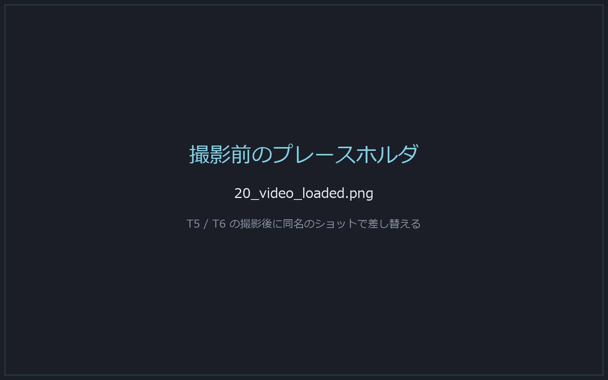

## 4. 再生とコマ移動

### 移動には 2 つの軸がある

**コマ送りと秒送りは別のキーに割り当てられています。** これは意図的な設計です。
「1 コマだけ動かしたい」と「10 秒先へ飛びたい」は別の操作で、混ぜると
どちらも使いにくくなるためです。

| | 小 | 中 | 大 |
|---|---|---|---|
| **コマ送り**（厳密に N コマ） | `,` / `.` | `Shift+,` / `Shift+.` | `Ctrl+,` / `Ctrl+.` |
| **秒送り** | `←` / `→` | `Shift+←` / `Shift+→` | `Ctrl+←` / `Ctrl+→` |

中・大の量は `Ctrl+P` の設定で変えられます（→ [§12](#12-設定)）。
コマ送りの中・大は **「オニオン間隔に追従」** にもでき、
オニオンスキンの層の間隔とコマ送りの量を一致させられます。

コマ送りは映像の**実タイムスタンプ**を基準にしているので、可変フレームレートの素材でも
1 コマずつ正確に進みます。

### 再生

| キー | 動作 |
|---|---|
| `Space` | 再生 / 停止 |
| `K` | 停止 |
| `J` / `L` | 速度を段階的に下げる / 上げる（0.1x 〜 2x） |
| `Home` / `End` | 先頭 / 末尾へ（区間ループがあればその端へ） |
| `P` | ループ ON/OFF |
| `M` | ミュート |
| `↑` / `↓` | 音量 |

速度を変えても**音程は変わります**（タイムストレッチはしていません）。

シークバーは**ドラッグでスクラブ**できます。コマ単位で、端まで行っても止まりません。
感度（px あたり何コマ動くか）は設定で変えられます。

### 区間ループ

| キー | 動作 |
|---|---|
| `I` | イン点を現在位置に設定 |
| `O` | アウト点を現在位置に設定 |
| `Shift+I` / `Shift+O` | それぞれ解除 |

設定した区間はシークバー上に表示されます。歩行 1 サイクルだけを繰り返し観察する、
といった使い方をします。


## 5. 線画抽出

右パネルの **`抽出`** タブで方式を選びます。**`ML (Lineart)` / `シェーダ` / `なし`** の 3 択です。


### シェーダ抽出（無料）

追加導入なしで動きます。**まずはこれから試してください。**

- **プリセット**: `Anime`（アニメ素材向け）/ `Live Action`（実写素材向け）
- **エンジン**: `XDoG` / `DoG` / `Sobel`（`E` キーで巡回）
- 調整: `ぼかし半径` `しきい値` `やわらかさ`、DoG 系ではさらに `DoG σ` `DoG k`、
  XDoG では `XDoG φ`

`Shift+1` / `Shift+2` / `Shift+3` で `Anime` / `Live Action` / 抽出なし に一発で切り替わります。

### ML 抽出（Pro）

学習済みモデル（Lineart）で線を起こします。シェーダより線の質が高く、
特に人物や複雑な形で差が出ます。

**モデルは配布物に同梱していません。** 抽出方式を `ML (Lineart)` にすると
`Lineart モデル: 未導入` と表示されるので、**`導入 (~17MB)`** を押してください。
ダウンロードとハッシュ検証を経て `OnionPlayerData/models/` に配置されます。

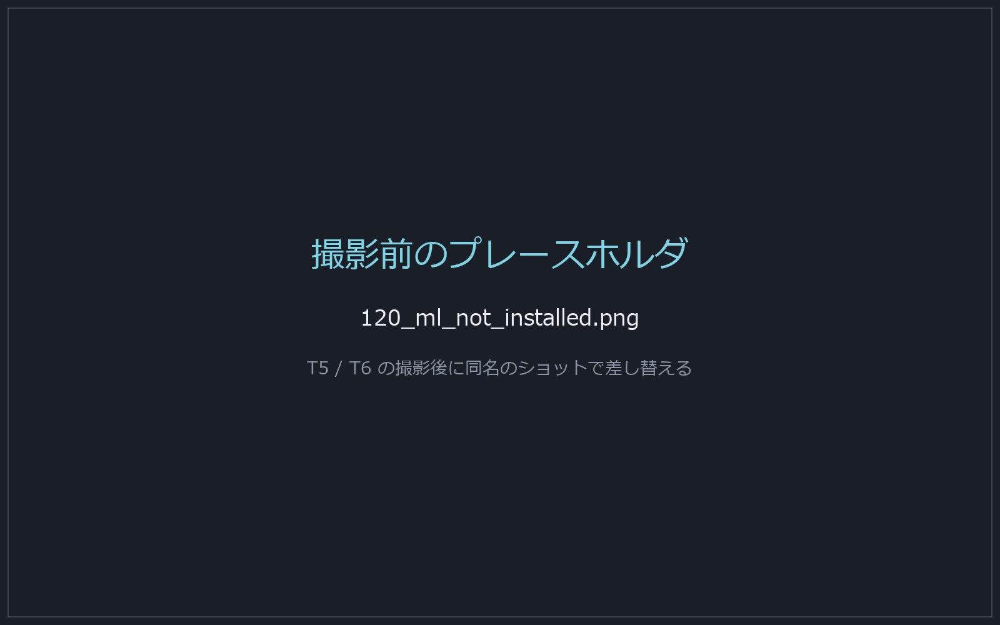

- **導入（ダウンロード）は無料で通ります。**（**抽出の実行**が Pro です）
- ML が追いつかない間は自動でシェーダ抽出に落ち、画面に
  `シェーダ抽出(ML 追いつき待ち)` と出ます。故障ではありません。
- `線の強さ` と `黒レベル` で線の出方を調整できます。合成時に適用されるので即座に反映されます。

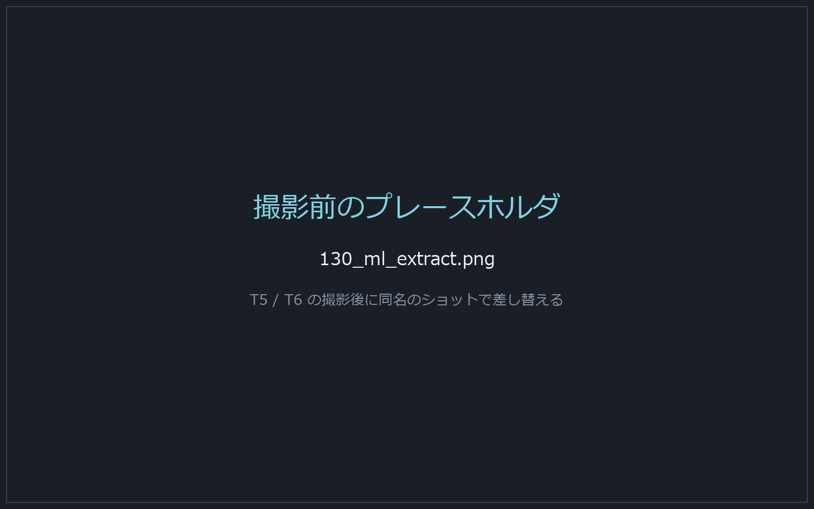

### 明部の輪郭

輝度がしきい値を超える領域の**境界線**を補助レイヤとして重ねます。
発光しているもの（光源・ハイライト）の形を拾いたいときに使います。ゴースト層にも出ます。

### 線色

線を `黒` で出すか `白` で出すかを切り替えます。素材が暗いときは白が読みやすくなります。

## 6. オニオンスキン

**`N`** で ON / OFF。このアプリの中心機能で、**全機能が無料で使えます**。

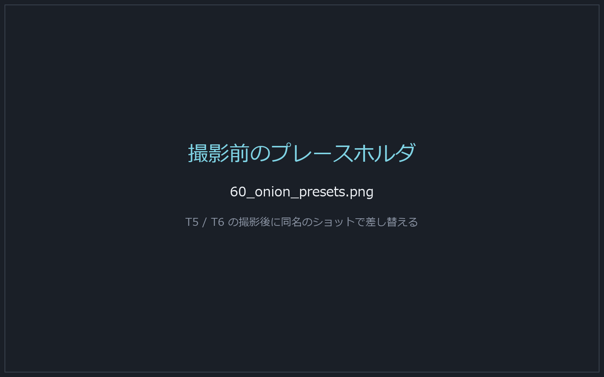

### プリセット

| プリセット | 構成 | 用途 |
|---|---|---|
| **中割り** | 前後 1 コマ | 中割りの位置決め |
| **軌道** | 前後 4 コマ連続 | 動きの軌跡を追う |
| **スペーシング** | 3 コマおき | タメ・ツメの間隔を計測 |
| **広域** | 前後 8 コマ・2 コマおき | 運動の包絡線 |

`Shift+N` でプリセットを巡回できます。

### 層の構成

| 項目 | 説明 | キー |
|---|---|---|
| `前後に敷く枚数` | 何層重ねるか | `]` / `[` |
| `間隔` | 層と層の間のコマ数 | `=` / `-` |
| `起点` | 一番手前の層の不透明度 | — |
| `減衰` | 遠い層ほど薄くする度合い（0 で減らさない） | — |

**`間隔` を大きくすると、等間隔に並んだゴーストがそのままスペーシングチャートになります。**

### イコライザ（層ごとの上書き）

層ごとの濃さを個別に変えられます。特定の層だけを強調したいときに使います。
**ダブルクリックでその層を既定へ戻し**、`ランプを既定へ` で全部戻ります。

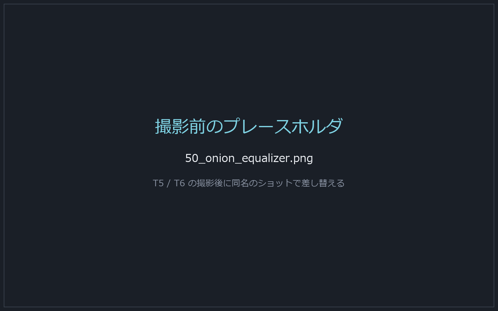

### 着色

過去の層は暖色、未来の層は寒色で着色されます。`過去` / `未来` の色そのものと、
`着色強度` を変えられます。**着色強度 0 で線画の色のまま**になります。

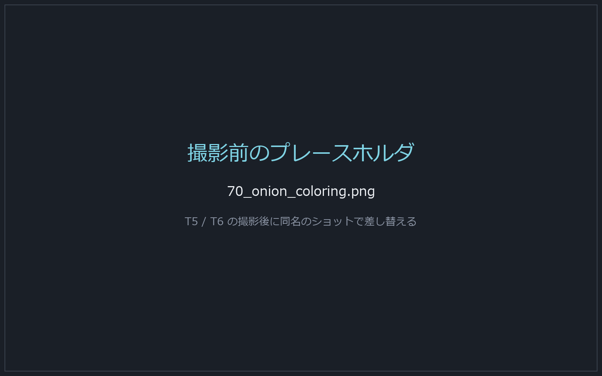

### 基準と刻み

- **`基準`** — ゴーストをどこを中心に張るか。**`再生位置`** か **`キーフレーム`**（`Shift+A` で切替）
- **`刻み`** — 層と層の間隔を **`間隔`**（コマ数）で決めるか **`キーフレーム`** で決めるか（`C` で切替）

`刻み = キーフレーム` にすると、**1 層 = 次のキーフレームまで**になります。
打ったキーフレームを原画に見立てて、その間を見るという使い方ができます。

### 一時的に消す・見る

- **`B`** — 押している間だけオニオンスキンを消す
- **`V`** — 押している間だけ元動画のみを表示

比較のたびに ON/OFF を切り替える必要はありません。

## 7. キーフレームとめくり

### キーフレーム

| キー | 動作 |
|---|---|
| `A` | 現在フレームにキーフレームを打つ / 消す |
| `Q` / `W` | 前 / 次のキーフレームへ移動 |
| `Shift+A` | 基準を キーフレーム ⇔ 再生位置 で切替 |

打ったキーフレームはシークバー上にマーカーとして出て、`オニオン` タブに一覧が出ます。
一覧の行からジャンプでき、個別削除も全消しもできます。

**キーフレームは動画ごとに保存されます**（最大 50 本ぶん。古いものから消えます）。
同じ素材を開き直せば前回打った位置が戻ります。

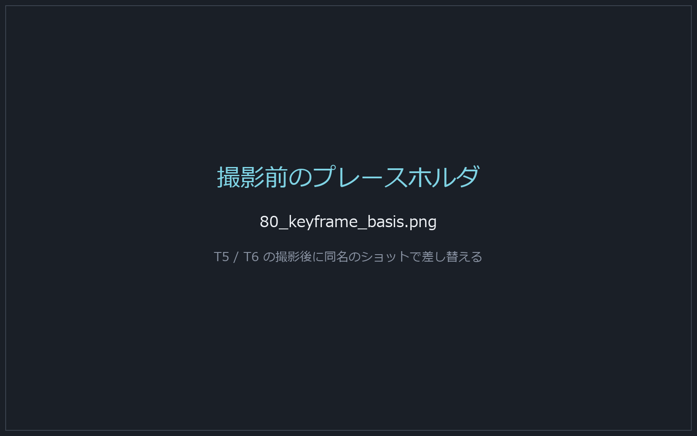

### めくり（フリップ）

**`1` 〜 `9` を押している間**、その層だけを濃く表示します。
`5` が現在、`1` が 4 コマ前、`9` が 4 コマ後です。

- `Z` / `X` — めくりカーソルを前 / 次へ動かす
- `Esc` — めくりを解除

紙をめくって前後を見比べる動作を、そのままキーに割り当てたものです。

### パラパラ（フリップブック）

- **`F`** — 一回だけ自動送り
- **`Shift+F`** — ループで自動送り

速度は `パラパラFPS` で調整します。既定は「実効フレームレート ÷ 間隔」で、
この値は保存されません。

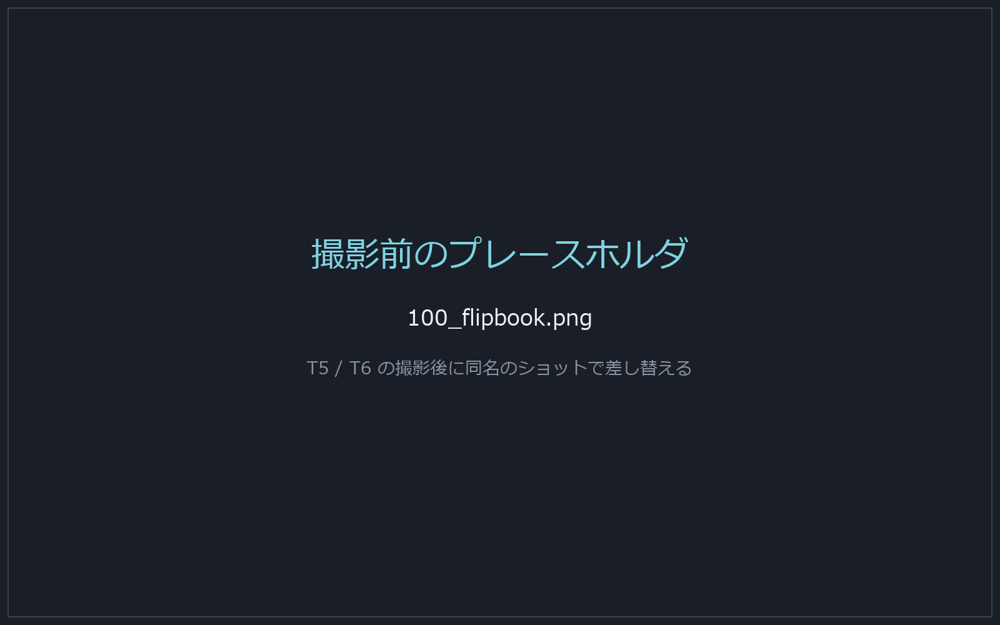

## 8. 表示の調整

### 重ねる / 並べる

**`S`** で切り替えます。

- **`重ねる`** — 元動画を下敷きにして線画を重ねる。`元動画` スライダーで下敷きの濃さを調整
- **`並べる`** — 元動画とオニオンを 2 ペインに分ける。向きは `自動` / `横` / `縦`


### オニオンのレイアウト

**`並べる` のときだけ**、オニオン側の並べ方を選べます。

- **`重ねる`** — 1 枚に重ねる
- **`リスト`** — 1 列に並べる（各層は不透明度 1）
- **`グリッド`** — 格子に並べる（各層は不透明度 1）

リストとグリッドでは各層がはっきり見えるので、**タイムシートのように読めます**。

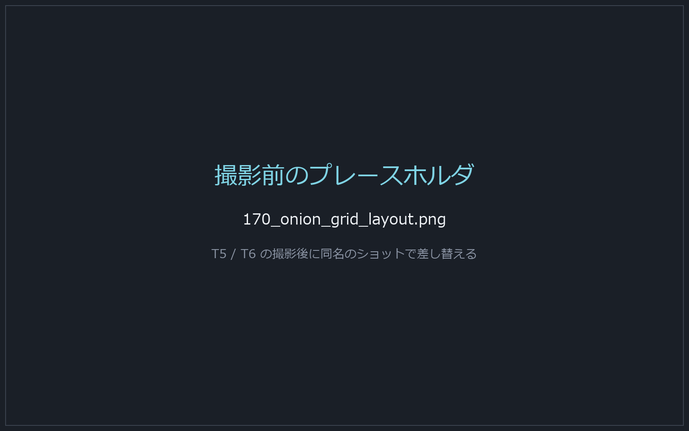

### 方眼

**`G`** で ON / OFF。分割数（2〜32）と濃さを変えられます。セルは常に正方形で、
全ペインに同じ方眼がかかります。位置やサイズの比較に使います。

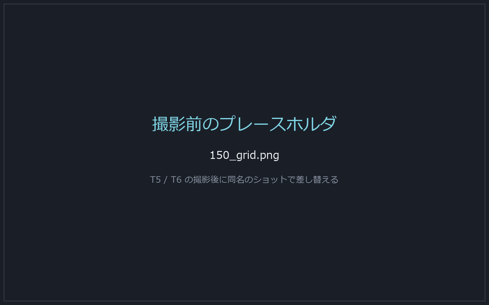

### ズーム・パン・集中モード

| 操作 | 動作 |
|---|---|
| `Ctrl+ホイール` | ズーム |
| `Ctrl+ドラッグ` | パン（ズーム中） |
| `Ctrl+0` | ズームをリセット（全面フィット） |
| **`Tab`** | **集中モード** — ヘッダー・パネル・バーを一括で消す |

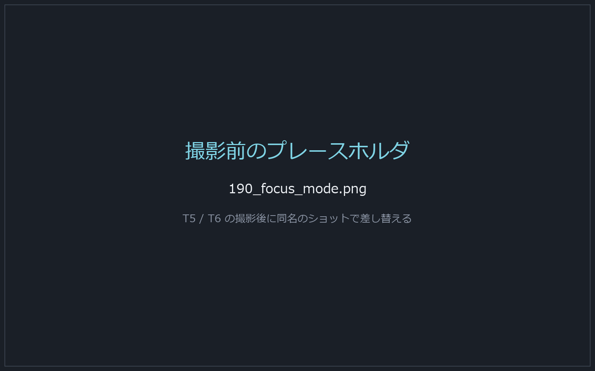

## 9. 静止部の除去

**`D`** で ON / OFF。**無料機能です。**

低解像度の背景モデル（中央値合成）を作り、**動いていない部分の線を落とします**。
背景の模様やディテールが線として出てしまい、動きが読みにくいときに効きます。

| 項目 | 説明 |
|---|---|
| `しきい値` | どれだけ動いていれば「動いた」と見なすか |
| `残す濃さ` | 静止部の線をどれだけ残すか |
| `静止部の不透明度` | 背景モデルを下敷きとして表示する濃さ（合成の成否確認用） |

ON にした直後は画面に `背景モデルを作成中` と出ます。作成が終わると反映されます。

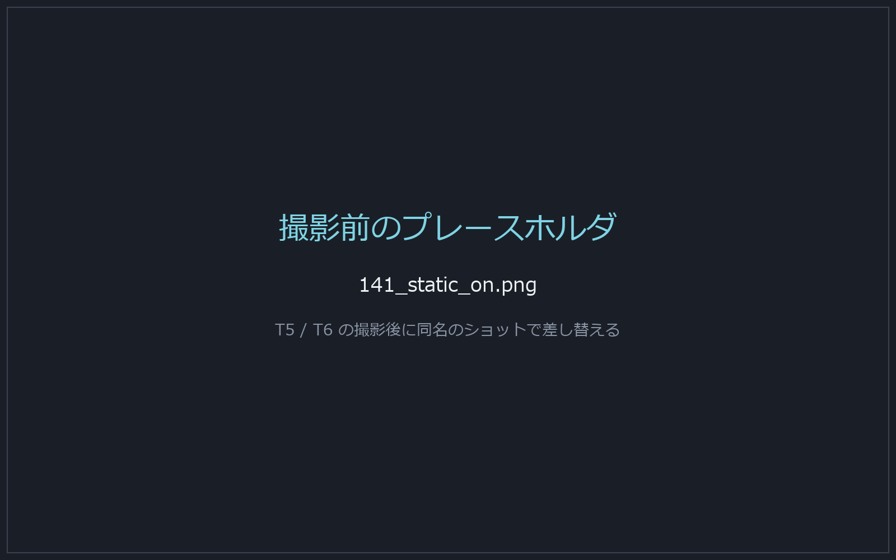

> ⚠️ **カメラが動いている素材では効きません。** 背景も「動いたもの」と判定されるためです。
> 効果を出すには**カメラが固定された素材**が要ります。これは仕様上の前提です。
>
> 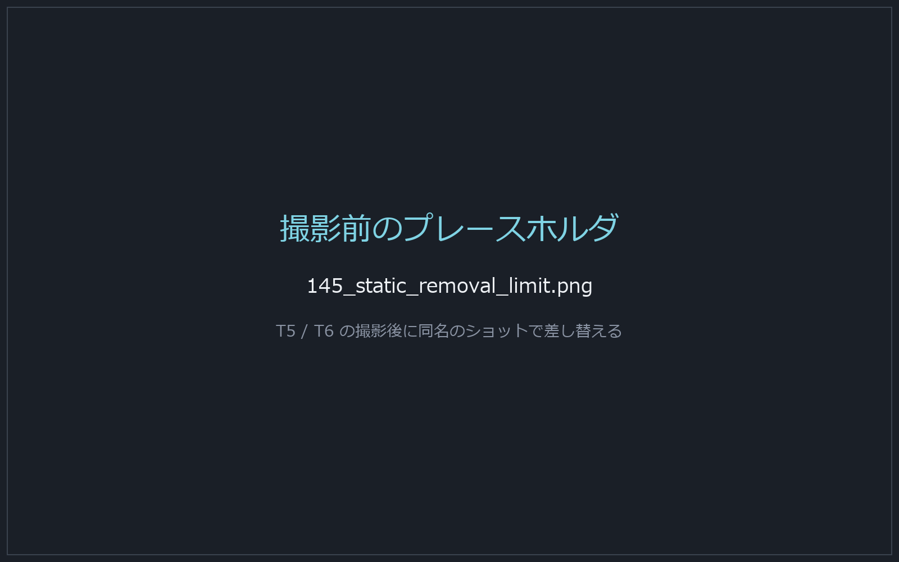

## 10. 書き出し

**`Ctrl+S`** で書き出しダイアログ、**`Ctrl+C`** で直前の設定のままクリップボードへコピーします。
**Pro 機能です。**


### 出力の形

| 形 | 内容 |
|---|---|
| **重ねた 1 枚** | 画面で見えているとおりに合成した 1 枚 |
| **並べた 1 枚（シート）** | 各層を並べた 1 枚。長辺 8192px に収まるよう縮小されます |
| **層ごとに複数ファイル** | 層を分解して個別の PNG に。**常に透過背景**になります |

### オプション

- **`背景を透明にする`** — 透過 PNG で出力（層ごとの場合は常に透過）
- **`見えている範囲だけ`** — ズームしている場合、表示中の範囲だけを切り出します
- **`方眼を焼き込む`** — 画面の方眼表示とは独立して、書き出しに方眼を描きます

出力は**素材の解像度が基準**で、画面の表示サイズには依存しません。
枚数と出力サイズはダイアログに表示され、進捗の途中で中断できます。

## 11. Pro とライセンス

### 無料でできること

**このアプリの中心機能は無料側にあります。**

> 再生・トランスポート・区間ループ / **シェーダ抽出**（Sobel・DoG・XDoG）/
> **オニオンスキンの全機能**（層数・間隔・イコライザ・レイアウト・プリセット・キーフレーム）/
> **静止部の除去** / **方眼** / 重ねる・並べる / 集中モード

### Pro で解放されるもの

- **ML 抽出**（Lineart）
- **書き出し**（保存・クリップボードへのコピー・層ごとの出力）

Pro 機能に触れると「Pro ライセンスが必要です」というダイアログが出ます。


### ライセンスの認証

ヘッダーの鍵アイコンから **`ライセンス`** を開き、キーを入力して `認証` を押します。

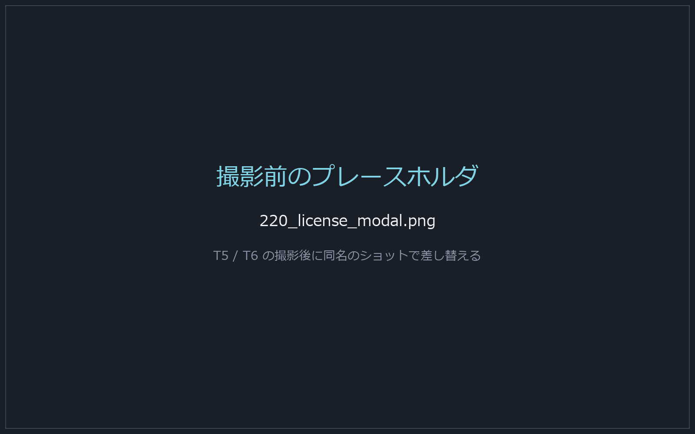

- **`再検証`** — 現在の状態を確認し直します
- **`この端末を解除`** — この端末の認証を外します。同じキーを別の端末で使えるようになります
- オフラインでも猶予期間のあいだは使えます。猶予を超えると再検証を求められます

> **ライセンスは `OnionPlayerData` の中には入りません。**
> Windows の資格情報として保存されるため、**ポータブル物を別の PC へ移すと
> データは付いてきますがライセンスは付いてきません**。移した先で認証し直してください。

## 12. 設定

**`Ctrl+P`** で開きます。

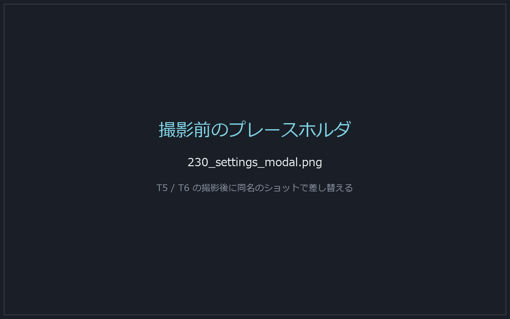

| セクション | 項目 |
|---|---|
| **秒送り** | `基本(秒)`、`Shift 倍率(×)`、`Ctrl 倍率(×)` |
| **コマ送り** | `基本`（1 コマ固定）、`Shift 段` / `Ctrl 段`（**`オニオン間隔に追従`** か数値）、`スクラブ感度(px/コマ)` |
| **音量** | `キー1回の変化幅(%)` |
| **リセット** | `設定を既定に戻す` / `すべての動画のキーフレームを消す` |

各項目には実際に適用される値（`×10 → 10.0 秒` など）が併記されます。

**リセットは範囲が限定されています。** 設定を戻してもキーフレームは消えず、
キーフレームを消しても設定は残ります。**どちらもライセンスと ML モデルには触れません。**

## 13. キーボード操作の一覧

**`F1`** でアプリ内の操作一覧が開きます。以下はその写しです。

### 再生

| キー | 動作 |
|---|---|
| `Space` | 再生 / 停止 |
| `K` | 停止 |
| `L` / `J` | 速度アップ / ダウン（段階） |
| `ホイール` | 再生速度 |
| `Home` / `End` | 先頭 / 末尾へ（イン点・アウト点があればそこへ） |
| `P` | ループ再生 ON/OFF |
| `M` | ミュート ON/OFF |
| `↑` / `↓` | 音量 |

### 移動

| キー | 動作 |
|---|---|
| `,` / `.` | コマ送り 戻し / 送り（1 コマ） |
| `Shift+,` / `Shift+.` | コマ送り（中） |
| `Ctrl+,` / `Ctrl+.` | コマ送り（大） |
| `←` / `→` | 秒送り 戻し / 送り |
| `Shift+←` / `Shift+→` | 秒送り（中） |
| `Ctrl+←` / `Ctrl+→` | 秒送り（大） |
| `ドラッグ` | スクラブ（コマ単位・無限） |

### 区間ループ

| キー | 動作 |
|---|---|
| `I` / `O` | イン点 / アウト点を現在フレームに設定 |
| `Shift+I` / `Shift+O` | イン点 / アウト点を解除 |

### オニオンスキン

| キー | 動作 |
|---|---|
| `N` | オニオンスキン ON/OFF |
| `B` | 押している間オニオンスキンを消す |
| `]` / `[` | 前後の層数を増やす / 減らす |
| `=` / `-` | 間隔を広げる / 詰める |
| `Shift+N` | プリセットを巡回 |
| `1`〜`9` | めくり（1 = 4 コマ前 … 5 = 現在 … 9 = 4 コマ後） |
| `F` / `Shift+F` | パラパラ（一回 / ループ） |
| `Z` / `X` | めくりを前 / 次へ |
| `Esc` | めくりを解除 |
| `C` | 刻みの切替（間隔 ⇔ キーフレーム） |
| `A` | キーフレームを打つ / 消す |
| `Q` / `W` | 前 / 次のキーフレームへ |

### 表示

| キー | 動作 |
|---|---|
| `V` | 押している間、元動画のみ表示 |
| `Tab` | 集中モード |
| `Shift+A` | 基準の切替（再生位置 ⇔ キーフレーム） |
| `S` | 並べて表示 / 重ねて表示 |
| `G` | 方眼の表示切替 |
| `Ctrl+0` | ズームをリセット |
| `Ctrl+ホイール` / `Ctrl+ドラッグ` | ズーム / パン |

### 抽出

| キー | 動作 |
|---|---|
| `Shift+1` / `Shift+2` / `Shift+3` | プリセット: Anime / Live Action / 抽出なし |
| `E` | 抽出エンジンを巡回 |
| `D` | 静止部の除去 切替 |

### 書き出し・その他

| キー | 動作 |
|---|---|
| `Ctrl+C` | 現在フレームをコピー |
| `Ctrl+S` | 書き出し |
| `F1` / `Ctrl+P` / `Ctrl+O` | 操作一覧 / 設定 / 動画を開く |


## 14. データの保存先と持ち運び

設定・キーフレーム・導入した ML モデルは、**`OnionPlayer.exe` と同じ場所に作られる
`OnionPlayerData` フォルダ**に入ります。

```
OnionPlayer/
├─ OnionPlayer.exe
├─ DirectML.dll
├─ README.txt
└─ OnionPlayerData/
   ├─ settings.json     … 設定
   ├─ keyframes.json    … 動画ごとのキーフレーム
   └─ models/           … 導入した ML モデル
```

- **Windows のユーザーフォルダは汚しません。**
- **フォルダごと移動・コピーすれば、設定もキーフレームもモデルも付いてきます。**
- **ライセンスだけはこの中に入りません**（→ [§11](#11-pro-とライセンス)）。
- 書き込みできない場所（読み取り専用メディアなど）に置いた場合も、**動画を開いて観る機能は
  そのまま使えます。** 設定が保存されないだけで、そのことは画面に表示されます。黙って捨てることはしません。

## 15. 困ったとき

### 「動画を読み込めません」と出る

**対応形式は mp4 / webm だけです。** MOV / ProRes / MKV や連番画像は開けません。
mp4 か webm へ変換してから開いてください。

mp4 なのに開けない場合は、中のコーデックが OS のデコーダで扱えない可能性があります。
H.264 で再エンコードすると通ることが多いです。

### 「Pro ライセンスが必要です」と出る

**故障ではありません。** ML 抽出と書き出しは Pro 機能です（→ [§11](#11-pro-とライセンス)）。
シェーダ抽出とオニオンスキンは無料のまま使えます。

### 静止部の除去が効かない

**カメラが動いている素材では効きません**（→ [§9](#9-静止部の除去)）。
カメラが固定された素材で試してください。

### 画面に「シェーダ抽出(ML 追いつき待ち)」と出る

ML の処理が再生に追いついていない間の**自動フォールバック**です。故障ではありません。
先読みキャッシュが進めば ML 抽出に戻ります。素材の解像度を下げると安定します。

### 「WebGL2 が利用できません」と出る

描画に WebGL2 が必要です。グラフィックドライバを更新してください。

### 別の PC へ移したらライセンスが外れた

**仕様です。** ライセンスは `OnionPlayerData` の外（Windows の資格情報）にあるため、
ポータブル物と一緒には移動しません。移した先で認証し直してください
（元の端末で `この端末を解除` を押してからだと確実です）。

### 設定を最初からやり直したい

`Ctrl+P` → `リセット` の `設定を既定に戻す`。キーフレーム・ライセンス・ML モデルは消えません。
